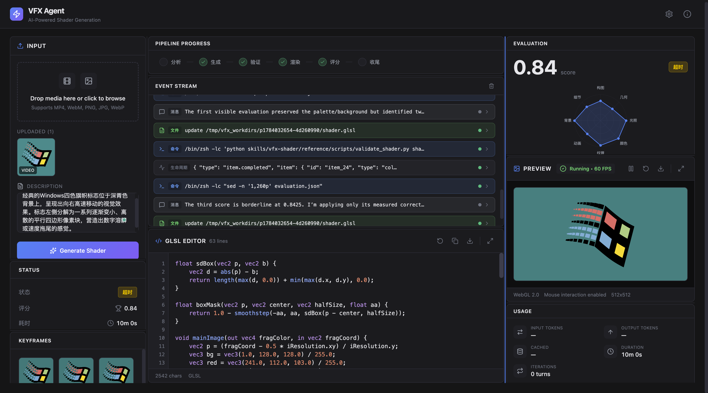

# VFX-Agent

<div align="center">

**基于 AI Agent 的视效代码自动生成系统**

从 UX 视频/图片输入自动生成 Shadertoy 格式 GLSL 着色器代码

[English](#english) | [中文文档](#中文文档)

</div>

---

## 中文文档

### 项目简介

VFX-Agent 是一个 AI Agent 驱动的视效代码自动生成系统：从 UX 视频 / 图片 / 文本描述输入，自动生成 Shadertoy 格式 GLSL 着色器代码，并经隔离子 Agent 评分反馈迭代直至收敛。

**核心架构思想 —— 动态编排（Dynamic Orchestration）**：orchestrator 退化为最小骨架（关键帧提取 + 任务派发 + 状态持久化），将路由 / 迭代控制 / 评分等决策权下放给 agent 通过 `SKILL.md` 自主管理，避开传统静态 DAG（如 LangGraph）的路由僵化问题。

**后端可插拔**：架构层面不绑定特定 agent runtime，已实现 [BaseBackend](backend/app/backends/base.py) 抽象 + 自动注册机制。当前支持 **3 个 backend**：

- [codex CLI](https://developers.openai.com/codex)（OpenAI）— 默认 backend
- [Claude Code](https://docs.anthropic.com/en/docs/claude-code)（Anthropic / DeepSeek / 其他 Anthropic-compatible）
- [Kimi Code](https://moonshotai.github.io/kimi-code/)（Moonshot K3）— 国产模型，多模态原生

新增 backend 只需 ~150 行（继承 BaseBackend，实现 3 个 abstract 方法），orchestrator / SKILL 资产 / 前端 / 测试基础设施全部复用。

**核心能力**：
- 🎨 多模态输入：支持图片、视频、纯文本描述
- 🤖 动态编排：agent 按 `SKILL.md` 6-phase 自主工作流执行（分析 → 生成 → 验证 → 渲染 → 评分 → 迭代），orchestrator 不做硬编码路由
- 🔌 多 backend：codex / claude-code / kimi 三种 agent runtime 可在 SettingsPanel 一键切换
- 🔄 自动迭代优化：子 Agent 隔离评分 + 语义反馈修正
- ⚡ 实时预览：WebGL Shader 渲染 + 实时编辑

**范围界定**：
- ✅ 2D/2.5D 平面动效（涟漪、光晕、磨砂、流光等 UI 视效）
- ✅ 移动端和 Web 平台
- ❌ 3D raymarching/场景渲染/体渲染（不在当前范围）

### 系统截图



WebUI 三栏布局：左侧输入面板（上传 + 描述）+ 中间 WebGL shader 实时预览 + 右侧 pipeline 进度日志 / 参数 / 评分面板。所选 backend（codex / claude-code / kimi）的 agent 在后台自主完成 6-phase 工作流，前端实时推送状态。

---

### 使用场景

#### 🎨 UX 设计师快速生成 Shader 原型
上传设计稿或动效参考，自动生成可运行的 GLSL 代码，无需手写 Shader。

#### 🎬 动效设计验证
将 UX 视频转换为 Shader 代码，验证动效逻辑是否符合预期。

#### ✨ UI 视效生成
快速生成常见 UI 视效：涟漪（Ripple）、光晕（Glow）、磨砂玻璃（Frosted Glass）、流光（Shimmer）、渐变动画（Gradient Animation）、波纹（Wave）等。

---

### 设计灵感

v2.0 的 **codex OD（Orchestrated Dispatch）动态编排** 借鉴了当前流行的 agent 系统模式：

- **[AutoResearchClaw](https://github.com/aiming-lab/AutoResearchClaw)** — 23-stage 自主研究管线，通过 [acpx 协议](https://github.com/openclaw/acpx)抽象 agent 后端，支持 Claude Code / Codex / OpenCode / Copilot / Gemini / Kimi 多 ACP 后端，stage 间可回滚 / PIVOT。本项目的"orchestrator 退化为骨架 + agent 自主路由"思路直接受其启发。
- **[OpenDesign](https://github.com/nexu-io/open-design)** — agent-native 设计工具，coding agent（Claude Code / Codex / Cursor 等）通过 `SKILL.md` + `DESIGN.md` + plugins 自主生成设计产物。本项目复用其 `SKILL.md` 编排模式（agent skills 标准化、文件即合约）。
- **[Loop Engineering](https://github.com/cobusgreyling/loop-engineering)** — Addy Osmani / Cobus Greyling 推广的 agent 工程哲学（"Stop prompting. Design the loop."），定义 5 个核心 primitives（Automations / Worktrees / Skills / MCP Connectors / Sub-agents）+ Memory spine。v2.0 当前实现了 Skills + Sub-agents + Memory 三个核心 primitive；后续迭代将围绕单循环补齐外部结构（Reflexion 跨运行学习 / orchestrator 级独立 checker / token budget circuit-breaker）。
- **[OpenCode](https://opencode.ai)** / **[Claude Code](https://docs.anthropic.com/en/docs/claude-code)** — terminal-native agent skills 标准

**核心思想**：将"路由 / 迭代控制 / 评分"等决策权下放给 agent 自主管理（通过 `SKILL.md` 约束），而非 Python orchestrator 硬编码静态 DAG（v1.0 LangGraph 模式）。Orchestrator 退化为最小骨架（FFmpeg + spawn + JSONL 解析），agent 自己决定何时迭代、何时收尾。

**当前支持后端**（已实现并通过 e2e 回归）：

| Backend | CLI Binary | 默认模型 | 特性 |
|---------|-----------|---------|------|
| [codex](https://developers.openai.com/codex)（默认） | `codex` (PATH) | OpenAI codex CLI default | 6-phase 全流程，spawn_agent subagent |
| [Claude Code](https://docs.anthropic.com/en/docs/claude-code) | `claude` (PATH) | Anthropic-compatible（如 DeepSeek） | Agent tool subagent + MCP 多模态 |
| [Kimi Code](https://moonshotai.github.io/kimi-code/) | `~/.kimi-code/bin/kimi`（v0.28.1+） | Moonshot K3（kimi-code/k3，1M context） | 国产模型，k3 原生 image_in + ReadMediaFile tool |

> Backend 切换：前端 SettingsPanel 下拉选择 + Apply → `PUT /config {backend: "kimi"}` → orchestrator 路由 → 对应 backend 的 `stream()` 调用。

新增 backend：参考 `docs/superpowers/specs/2026-07-17-multi-agent-backend-abstraction-design.md` + `docs/superpowers/specs/2026-07-22-kimi-backend-design.md`，实现 `BaseBackend` 3 个 abstract 方法（`setup_workspace` / `build_command` / `parse_event`），在 `backends/__init__.py` 注册一行即可。

---

### v2.0 架构设计

```
[输入] 视频/图片/文本描述
   │
   ▼
┌──────────────────────────────────────────────────────────────┐
│  Python Orchestrator (~300 行)                                │
│  FFmpeg 提关键帧 → symlink skills → spawn backend → 解析 JSONL│
│  不做迭代控制 / 评分 / 路由（全部委托给 backend agent）         │
│  backend 由 runtime config 决定（codex / claude-code / kimi） │
└──────────────────────────────────────────────────────────────┘
   │
   ▼
┌──────────────────────────────────────────────────────────────┐
│  Backend Agent 自主编排（按 SKILL.md，CLI-agnostic）           │
│                                                              │
│  Phase 1  Analyse  ──→  visual_description.json              │
│  Phase 2  Generate ──→  shader.glsl                          │
│  Phase 3  Validate ──→  compile check                        │
│  Phase 4  Render   ──→  Playwright screenshot                │
│  Phase 5  Evaluate ──→  subagent (隔离上下文，避免自评正偏差) │
│  Phase 6  Iterate  ──→  loop or finalize                     │
│                                                              │
│  ←── 迭代（max_iterations 由 SKILL.md 约束）──→              │
└──────────────────────────────────────────────────────────────┘
   │
   ▼
[输出] 最终 GLSL Shader + WebGL 预览 + 评分报告
```

**架构要点**：

| 组件 | 职责 |
|------|------|
| **Python Orchestrator** | FFmpeg 关键帧提取、workdir 创建、symlink skills、spawn backend、解析 JSONL、状态持久化。不做路由/评分/迭代控制。 |
| **Backend Agent（主）** | 按 `skills/vfx-shader/SKILL.md` 6-phase 自主工作流执行全流程。Backend 由 runtime config 决定（codex / claude-code / kimi）。 |
| **Subagent（Phase 5）** | 通过 backend 的 subagent 机制（codex `spawn_agent` / claude-code `Agent` tool / kimi `Agent` tool）隔离上下文评估渲染结果，输出结构化评分。 |
| **Skill 资产** | SKILL.md（6-phase 工作流，backend-agnostic）+ shader_templates.md（1200 行参考）+ few_shot_examples.md（9 个端到端示例）+ 脚本（验证/渲染/像素分析）。 |

---

### 技术栈

| 组件 | v2.0 技术 |
|------|-----------|
| Backend | Python 3.11+, FastAPI + BaseBackend 抽象层 |
| Agent runtime（可选其一） | codex CLI 0.144.1+ / Claude Code CLI / Kimi Code CLI v0.28.1+ |
| LLM 编排 | 动态编排（非 LangGraph），SKILL.md 主导 |
| Frontend | React 18, Vite, TypeScript |
| 渲染 | Three.js, WebGL（复用 v1.0） |
| 浏览器自动化 | Playwright |
| 视频处理 | FFmpeg |
| 状态持久化 | JSON 文件 |

---

### 快速开始

#### 环境要求

- Python 3.11+
- Node.js 18+
- FFmpeg（视频处理）
- 现代浏览器（支持 WebGL）

**至少安装一个 Agent runtime**（三选一或多选）：

| Backend | 安装命令 | 配置文件 |
|---------|---------|---------|
| codex CLI（默认） | `npm install -g @openai/codex` | `~/.codex/config.toml` |
| Claude Code | 见 [claude.ai/code](https://claude.ai/code) | `~/.claude.json`（全局） |
| Kimi Code | `npm install -g @moonshot-ai/kimi-code` 或 [official script](https://moonshotai.github.io/kimi-code/) | `~/.kimi-code/config.toml`（含 `default_model = "kimi-code/k3"`） |

#### 安装与启动

```bash
# 1. 克隆项目
git clone https://github.com/your-repo/VFX-Agent.git
cd VFX-Agent

# 2. 配置 API Keys
cd backend
cp .env.example .env
# 编辑 .env 文件，按所选 backend 填 PROXY / TIMEOUT
# Backend 切换在前端 SettingsPanel 下拉里完成（不需要重启）

# 3. 启动服务（自动安装依赖）
./start.sh start
```

#### 访问地址

| 服务 | 地址 |
|------|------|
| **Frontend (WebUI)** | http://localhost:5173 |
| **Backend (API)** | http://localhost:8000 |
| **API Docs** | http://localhost:8000/docs |

#### CLI 直接运行（不需要前端）

```bash
# 单样本
python benchmark/skills/vfx-benchmark/reference/run_v2_samples.py heart-2d

# 批量运行
python benchmark/skills/vfx-benchmark/reference/run_v2_samples.py 4-col-grad heart-2d shiny-circle
```

> 完整 benchmark 流程（含 backend 切换 / UI 模式 / 报告生成）见 [`benchmark/README.md`](benchmark/README.md)。

---

### 项目结构

```
VFX-Agent/
├── backend/
│   ├── app/
│   │   ├── main.py                   # FastAPI 入口
│   │   ├── config.py                 # v2.0 配置
│   │   ├── orchestrator.py (~300 行) # v2.0 核心编排器（backend-agnostic）
│   │   ├── state_store.py (~65 行)   # JSON 状态持久化
│   │   ├── backends/                 # 多 backend 适配层
│   │   │   ├── base.py               # BaseBackend ABC + AgentEvent + stream()
│   │   │   ├── codex.py              # codex CLI adapter（默认）
│   │   │   ├── claude_code.py        # Claude Code CLI adapter
│   │   │   ├── kimi.py               # Kimi Code CLI adapter（K3）
│   │   │   └── __init__.py           # BACKEND_REGISTRY + auto-register
│   │   ├── pipeline_states/          # 运行时状态 (.json)
│   │   ├── routers/                  # API 路由
│   │   │   ├── pipeline.py           # POST /run + GET /status（含 backend 参数）
│   │   │   └── config.py             # GET/PUT /config（runtime 配置）
│   │   ├── services/                 # 复用 v1.0 服务
│   │   │   ├── browser_render.py
│   │   │   ├── shader_render_page.html # v2.0 standalone HTML（WebGL2）
│   │   │   ├── shader_validator.py
│   │   │   ├── video_extractor.py
│   │   │   └── session_logger.py
│   │   └── skills/                   # v2.0 skill 资产（backend-agnostic）
│   │       ├── AGENTS.md (~470 行)   # 主 agent 指令（codex/claude/kimi 共用）
│   │       └── vfx-shader/
│   │           ├── SKILL.md (~415 行) # 6-phase 工作流
│   │           └── reference/
│   │               ├── shader_templates.md
│   │               ├── few_shot_examples.md
│   │               └── scripts/
│   │                   ├── validate_shader.py
│   │                   ├── render_shader.py
│   │                   └── analyze_pixels.py
│   ├── tests/
│   │   └── unit/                     # 单元测试（5 个文件，18 tests pass）
│   ├── requirements.txt
│   └── .env.example
├── frontend/                         # 复用 v1.0（最小改动）
│   ├── src/
│   │   ├── App.tsx
│   │   ├── components/               # InputPanel, ShaderEditor 等
│   │   └── hooks/usePipeline.ts
│   └── package.json
├── benchmark/                        # benchmark 工作目录（见 benchmark/README.md）
│   ├── skills/vfx-benchmark/         # opencode skill 定义 + 脚本 reference
│   ├── test-samples/                 # 测试数据集（git submodule）
│   └── test_results/                 # 测试结果归档 (.gitignored)
├── docs/
├── start.sh
└── README.md
```

---

### 测试结果

> 📁 **Benchmark 工作目录**：所有 benchmark 数据集（`test-samples/` submodule）、运行脚本（作为 opencode skill 的 reference）、历史归档集中在 [`benchmark/`](benchmark/) 目录。完整目录结构、执行流程、归档命名约定见 [**benchmark/README.md**](benchmark/README.md)。

> 📊 **完整 benchmark 详情**（每 sample 含 reference vs render 对比、UI 截图、backend 关键事件时间线、8 维 dimension 评分、shader 源码）见 [**GitHub Release v2.0.1**](https://github.com/yangfei1223/VFX-Agent/releases/tag/v2.0.1)（95MB tar.gz 归档，codex backend）。其他 backend 见下方"测试报告归档"。

#### 测试数据集

所有 benchmark 均基于作者个人收集整理的 [**vfx-shader-dataset**](https://github.com/yangfei1223/vfx-shader-dataset)（参考素材来自 Shadertoy，本地 `.gitignored`；非公开学术数据集）：

| 维度 | 数值 |
|------|------|
| 样本总数 | **50**（每样本 = `.webm` 参考视频 + `.json` 人工标注元数据） |
| 视效类别 | **9 类**：glow 14 / liquid 11 / particle 10 / shape 4 / space 4 / gradient 3 / warp 2 / ripple 1 / special 1 |
| 复杂度 | simple 19 / medium 25 / complex 6 |
| 动画 | 含动画 30 / 静态 20（flow 21 / pulse 5 / rotate 4 / morph 1 / none 19） |
| 范围 | 2D / 2.5D UI 视效，100% in-scope，**排除 3D raymarching / 场景渲染 / 体渲染** |

`.json` 标注字段：`effect_category` / `effect_name` / `visual_description`（自然语言描述） / `dominant_colors` / `key_elements` / `shape_type` / `fill_type` / `animation_type` / `complexity` / `is_2d` / `is_in_scope`，用于 Decompose Agent 评测对齐与样本难度分层。

#### 测试覆盖

- **50 samples**：v1.0 baseline 19 + 31 个新样本（覆盖 glow / particle / liquid / warp / 2D physics / dna helis / star tunnel 等视效类型）
- **Retry 机制**：第一轮 0 / 低分样本（多为瞬时编译失败、UI 截图时机问题）经 retry 后显著好转
- **前端路径驱动**：Playwright 模拟真实用户操作（上传 → 提交 → 轮询 → 截图）

> 注：评分机制（subagent 多模态对比）仍在迭代完善，绝对分数参考意义有限。实际生成 shader 的视觉效果和稳定性相比 v1.0 有显著提升，建议直接查看 release 归档里的 reference vs render 对比。

#### 测试报告归档（HTML 可视化报告）

每次 benchmark 跑完会生成完整的 HTML 可视化报告（含每个 sample 的 reference vs render 对比、UI 截图、backend 关键事件时间线、8 维 dimension 评分、shader 源码），打包为 `.tar.gz` 上传到对应 GitHub Release。归档只是 HTML / JSON / PNG，没有可执行二进制。

> 报告按 backend 分别归档，例如：
> - `2026-07-15_v2-codex-od-20samples/`（codex backend baseline）
> - `2026-07-21_v2-claude-code-20samples/`（Claude Code backend）
> - `2026-07-23_v2-kimi-20samples/`（Kimi K3 backend 完整 20-sample benchmark）

### Multi-backend 对比（20-sample 子集）

三 backend 跑同一组 20 sample（覆盖 gradient / glow / shape / liquid / particle / warp / ripple / flow 等 9 类效果），结果：

| Backend | 模型 | Passed (≥0.85) | Avg score | Δ vs v1.0 (0.715) | 备注 |
|---------|------|----------------|-----------|-------------------|------|
| **codex**（默认） | GPT-5.6 Sol | **6/20** | **0.762** | +0.047 | 整体最佳 |
| kimi | Kimi K3 | 4/20 | 0.689 | -0.026 | 接近 codex，显著优于 claude-code |
| claude-code | DeepSeek V4 Pro（走 `api.deepseek.com/anthropic`，非 Claude 官方模型） | 2/20 | 0.469 | -0.246 | 600s timeout 是主要瓶颈 |

> 三 backend 用同一份 SKILL.md / orchestrator / 测试基础设施，差异完全由 agent runtime + model 决定。Kimi K3 在 simple sample 上跟 codex 持平，复杂 sample 跟 claude-code 类似会撞 600s timeout。

| 版本 | 日期 | 后端 | 模型 | 样本数 | 报告归档 |
|------|------|------|------|--------|------|
| **v2.0.2-kimi** | 2026-07-23 | kimi | Kimi K3 | 20 | [Release v2.0.2-kimi](https://github.com/yangfei1223/VFX-Agent/releases/tag/v2.0.2-kimi)（47MB tar.gz） |
| **v2.0.2-claude-code** | 2026-07-23 | claude-code | **DeepSeek V4 Pro**（claude CLI 走 `api.deepseek.com/anthropic` endpoint，并非 Claude 官方模型） | 20 | [Release v2.0.2-claude-code](https://github.com/yangfei1223/VFX-Agent/releases/tag/v2.0.2-claude-code)（54MB tar.gz） |
| **v2.0.1** | 2026-07-16 | codex | GPT-5.6 Sol | 50（全量） | [Release v2.0.1](https://github.com/yangfei1223/VFX-Agent/releases/tag/v2.0.1)（95MB tar.gz，含 HTML + JSON + PNG） |
| v2.0.0 | 2026-07-15 | codex | GPT-5.6 Sol | 20 | [Release v2.0.0](https://github.com/yangfei1223/VFX-Agent/releases/tag/v2.0.0)（41MB tar.gz） |

#### 本地查看

```bash
# 解压 release tar.gz 后打开 HTML 报告
tar xzf v2.0.1-baseline-50samples.tar.gz
open benchmark/test_results/2026-07-16_v2-codex-od-50samples/index.html

# 自己跑 benchmark（显式传 sample 列表）
python benchmark/skills/vfx-benchmark/reference/run_v2_samples_via_ui.py <sample1> <sample2> ...
python benchmark/skills/vfx-benchmark/reference/collect_v2_results.py
python benchmark/skills/vfx-benchmark/reference/generate_v2_report.py
```

---

### 已知问题

| 问题 | 说明 | 优先级 |
|------|------|--------|
| 部分样本 shader 编译失败 | agent 生成的 GLSL 偶发语法 / 语义错误，渲染全黑（retry 通常可恢复） | P0 |
| 复杂样本 600s timeout | 单 pipeline 硬超时对复杂 effect type 不够，部分迭代未跑完 | P0 |
| Subagent 评分仍在迭代 | 多模态对比打分存在偏差，绝对分数参考意义有限，建议直接看 reference vs render 对比 | P1 |
| kimi backend 不输出 token usage | kimi-code CLI v0.28.1 的 `-p` 模式不返回 token 计数，前端 Usage 面板显示 "—"；功能不受影响 | P2 |

---

### v1.0 历史版本

v1.0（LangGraph 三 Agent 架构）已废弃。如需查看旧版代码，请 checkout `v1.0.0` tag。

---

### 配置说明

v2.0 通过 BaseBackend 抽象调用所选 agent runtime。**模型本身**（API key / base URL / model name）的配置在每个 backend 自己的全局 config 里：

| Backend | 模型配置位置 |
|---------|------------|
| codex | `~/.codex/config.toml`（`model = "..."` 字段） |
| claude-code | claude CLI 内部管理（可通过 `--model` flag 覆盖） |
| kimi | `~/.kimi-code/config.toml`（`default_model = "kimi-code/k3"`） |

`backend/.env` 只配置 orchestrator 行为参数（每 backend 各自的 proxy / timeout）：

```env
# Backend 默认选择（前端 SettingsPanel 可动态切换）
BACKEND=codex                        # codex | claude-code | kimi

# Codex 调用
CODEX_PROXY=http://127.0.0.1:7890    # codex exec 走代理（海外 API 必需）
CODEX_TIMEOUT=600                    # 单 pipeline 硬超时（秒）

# Claude Code 调用
CLAUDE_CODE_PROXY=                   # DeepSeek 等国内 endpoint 不需要代理
CLAUDE_CODE_TIMEOUT=600

# Kimi Code 调用（国产模型，无需代理）
KIMI_PROXY=
KIMI_TIMEOUT=600
KIMI_BIN_PATH=~/.kimi-code/bin/kimi  # Kimi Code CLI 二进制路径（不在 PATH 时显式指定）

# Pipeline 通用
PASSING_SCORE=0.85                   # subagent 评分通过阈值
MAX_ITERATIONS=5                     # SKILL.md 中约束的迭代上限

# 截图
SCREENSHOT_WIDTH=1280
SCREENSHOT_HEIGHT=720
RENDER_TIMEOUT_MS=2000

# Pipeline workdir 根目录（每个 pipeline 一个子目录）
WORKDIR_ROOT=/tmp/vfx_workdirs
```

**运行时切换 backend**（不需要重启服务）：
1. 前端 SettingsPanel → Backend dropdown → 选目标 backend → Apply
2. 或 `curl -X PUT http://localhost:8000/config -d '{"backend":"kimi",...}'`
3. 或在 POST `/pipeline/run` 时传 `backend=kimi` 字段（per-request 覆盖）

完整 schema 见 `backend/.env.example`。

---

### 参考文档

- **设计文档**：`docs/superpowers/specs/2026-07-13-vfx-agent-v2-codex-od-design.md`
- **codex Agent 指令**：`backend/app/skills/AGENTS.md`
- **6-phase 工作流**：`backend/app/skills/vfx-shader/SKILL.md`
- **Shader 模板库**：`backend/app/skills/vfx-shader/reference/shader_templates.md`
- **Few-shot 示例**：`backend/app/skills/vfx-shader/reference/few_shot_examples.md`
- **iq SDF 算子**：https://iquilezles.org/articles/distfunctions2d/
- **Shadertoy 案例**：https://www.shadertoy.com/

---

### 开源协议

MIT License

---

## English

### Project Overview

VFX-Agent is an AI Agent-driven system that automatically generates Shadertoy-format GLSL shader code from UX video / image / text inputs, with isolated subagent evaluation and iterative refinement until convergence.

**Core architectural idea — Dynamic Orchestration**: the orchestrator is reduced to a minimal skeleton (keyframe extraction + task dispatch + state persistence). Routing, iteration control, and evaluation decisions are delegated to the agent itself via `SKILL.md`, avoiding the rigidity of traditional static DAGs (e.g., LangGraph).

**Pluggable backends**: the architecture does not lock into any specific agent runtime. A [BaseBackend](backend/app/backends/base.py) ABC + auto-registry mechanism is implemented. Three backends are currently supported:

- [codex CLI](https://developers.openai.com/codex) (OpenAI) — default
- [Claude Code](https://docs.anthropic.com/en/docs/claude-code) (Anthropic / DeepSeek / other Anthropic-compatible)
- [Kimi Code](https://moonshotai.github.io/kimi-code/) (Moonshot K3) — Chinese-developed, multimodal-native

Adding a new backend takes ~150 lines (subclass `BaseBackend`, implement 3 abstract methods); orchestrator / SKILL assets / frontend / test infrastructure all reuse without modification.

**Key Features**:
- 🎨 Multimodal input: images, videos, text descriptions
- 🤖 Dynamic orchestration: agent runs an autonomous 6-phase workflow (analyse → generate → validate → render → evaluate → iterate) per `SKILL.md`; orchestrator does not hardcode routing
- 🔌 Multi-backend: switch between codex / claude-code / kimi in SettingsPanel without restart
- 🔄 Self-iteration with isolated subagent evaluation
- ⚡ Real-time WebGL shader preview + live editing

**Scope**:
- ✅ 2D / 2.5D planar motion effects (ripple, glow, frosted glass, shimmer, and other UI VFX)
- ✅ Mobile and Web platforms
- ❌ 3D raymarching / scene rendering / volume rendering (out of current scope)

---

### Use Cases

#### 🎨 Rapid Shader prototyping for UX designers
Upload a design mock or motion reference; auto-generate runnable GLSL code without hand-writing shaders.

#### 🎬 Motion design verification
Convert a UX video into shader code to verify whether the motion logic meets expectations.

#### ✨ UI VFX generation
Rapidly produce common UI effects: Ripple, Glow, Frosted Glass, Shimmer, Gradient Animation, Wave, etc.

---

### Design Inspiration

The **codex OD (Orchestrated Dispatch)** dynamic orchestration in v2.0 borrows from current popular agent system patterns:

- **[AutoResearchClaw](https://github.com/aiming-lab/AutoResearchClaw)** — a 23-stage autonomous research pipeline that abstracts agent backends via the [acpx protocol](https://github.com/openclaw/acpx), supporting Claude Code / Codex / OpenCode / Copilot / Gemini / Kimi; stages can roll back or PIVOT. Directly inspired this project's "skeleton orchestrator + agent-driven routing" idea.
- **[OpenDesign](https://github.com/nexu-io/open-design)** — agent-native design tool where coding agents (Claude Code / Codex / Cursor, etc.) autonomously produce design artifacts via `SKILL.md` + `DESIGN.md` + plugins. We reuse its `SKILL.md` orchestration model (standardized agent skills, files-as-contracts).
- **[Loop Engineering](https://github.com/cobusgreyling/loop-engineering)** — agent engineering philosophy promoted by Addy Osmani / Cobus Greyling ("Stop prompting. Design the loop."), defining 5 core primitives (Automations / Worktrees / Skills / MCP Connectors / Sub-agents) + a memory spine. v2.0 currently implements Skills + Sub-agents + Memory; future iterations will round out the single loop (cross-run Reflexion learning / orchestrator-level independent checker / token budget circuit-breaker).
- **[OpenCode](https://opencode.ai)** / **[Claude Code](https://docs.anthropic.com/en/docs/claude-code)** — terminal-native agent skills standard.

**Core idea**: delegate "routing / iteration control / scoring" decisions to the agent itself (constrained by `SKILL.md`) rather than hardcoding a static DAG in the Python orchestrator (the v1.0 LangGraph pattern). The orchestrator shrinks to a minimal skeleton (FFmpeg + spawn + JSONL parsing); the agent decides when to iterate and when to finalize.

**Currently supported backends** (implemented and verified by e2e regression):

| Backend | CLI Binary | Default Model | Features |
|---------|-----------|---------------|----------|
| [codex](https://developers.openai.com/codex) (default) | `codex` (PATH) | OpenAI codex CLI default | full 6-phase pipeline, `spawn_agent` subagent |
| [Claude Code](https://docs.anthropic.com/en/docs/claude-code) | `claude` (PATH) | Anthropic-compatible (e.g. DeepSeek) | `Agent` tool subagent + MCP multimodal |
| [Kimi Code](https://moonshotai.github.io/kimi-code/) | `~/.kimi-code/bin/kimi` (v0.28.1+) | Moonshot K3 (kimi-code/k3, 1M context) | Chinese model, native K3 `image_in` + `ReadMediaFile` tool |

> Backend switching: frontend SettingsPanel dropdown → Apply → `PUT /config {backend: "kimi"}` → orchestrator routes → the corresponding backend's `stream()` is invoked.

Adding a backend: see `docs/superpowers/specs/2026-07-17-multi-agent-backend-abstraction-design.md` + `docs/superpowers/specs/2026-07-22-kimi-backend-design.md`; implement the 3 abstract methods of `BaseBackend` (`setup_workspace` / `build_command` / `parse_event`) and register one line in `backends/__init__.py`.

---

### v2.0 Architecture

```
[Input] video / image / text description
    │
    ▼
┌──────────────────────────────────────────────────────────────┐
│  Python Orchestrator (~300 LOC)                               │
│  FFmpeg keyframes → symlink skills → spawn backend → parse   │
│  JSONL. No iteration control / scoring / routing decisions   │
│  (all delegated to the backend agent).                       │
│  Backend selected by runtime config (codex/claude-code/kimi).│
└──────────────────────────────────────────────────────────────┘
    │
    ▼
┌──────────────────────────────────────────────────────────────┐
│  Backend Agent autonomous orchestration (per SKILL.md,       │
│  CLI-agnostic)                                               │
│                                                              │
│  Phase 1  Analyse  ──→  visual_description.json              │
│  Phase 2  Generate ──→  shader.glsl                          │
│  Phase 3  Validate ──→  compile check                        │
│  Phase 4  Render   ──→  Playwright screenshot                │
│  Phase 5  Evaluate ──→  subagent (isolated context, avoids   │
│                        positive bias of self-evaluation)     │
│  Phase 6  Iterate  ──→  loop or finalize                     │
│                                                              │
│  ←── iteration (max_iterations bounded by SKILL.md) ──→      │
└──────────────────────────────────────────────────────────────┘
    │
    ▼
[Output] final GLSL shader + WebGL preview + score report
```

**Architecture essentials**:

| Component | Responsibility |
|-----------|---------------|
| **Python Orchestrator** | FFmpeg keyframe extraction, workdir creation, symlink skills, spawn backend, JSONL parsing, state persistence. Does NOT do routing / scoring / iteration control. |
| **Backend Agent (main)** | Executes the 6-phase workflow per `skills/vfx-shader/SKILL.md`. Backend is chosen by runtime config (codex / claude-code / kimi). |
| **Subagent (Phase 5)** | Evaluates render result via the backend's subagent mechanism (codex `spawn_agent` / claude-code `Agent` tool / kimi `Agent` tool) in an isolated context, outputting a structured score. |
| **Skill assets** | SKILL.md (6-phase workflow, backend-agnostic) + shader_templates.md (~1200 LOC reference) + few_shot_examples.md (9 end-to-end examples) + scripts (validate / render / pixel analysis). |

---

### Tech Stack

| Component | v2.0 Tech |
|-----------|-----------|
| Backend | Python 3.11+, FastAPI + BaseBackend abstraction layer |
| Agent runtime (one or more) | codex CLI 0.144.1+ / Claude Code CLI / Kimi Code CLI v0.28.1+ |
| LLM orchestration | Dynamic orchestration (not LangGraph), driven by SKILL.md |
| Frontend | React 18, Vite, TypeScript |
| Rendering | Three.js, WebGL (reused from v1.0) |
| Browser automation | Playwright |
| Video processing | FFmpeg |
| State persistence | JSON files |

---

### Quick Start

#### Prerequisites

- Python 3.11+
- Node.js 18+
- FFmpeg (for video processing)
- A modern browser with WebGL support

**Install at least one agent runtime** (choose one or more):

| Backend | Install | Config file |
|---------|---------|------------|
| codex CLI (default) | `npm install -g @openai/codex` | `~/.codex/config.toml` |
| Claude Code | see [claude.ai/code](https://claude.ai/code) | `~/.claude.json` (global) |
| Kimi Code | `npm install -g @moonshot-ai/kimi-code` or the [official script](https://moonshotai.github.io/kimi-code/) | `~/.kimi-code/config.toml` (set `default_model = "kimi-code/k3"`) |

#### Setup & launch

```bash
# 1. Clone (with benchmark dataset submodule)
git clone --recurse-submodules https://github.com/yangfei1223/VFX-Agent.git
cd VFX-Agent

# 2. Configure API keys
cd backend
cp .env.example .env
# Edit .env to fill PROXY / TIMEOUT for the chosen backend.
# Backend switching is done from the frontend SettingsPanel (no restart needed).

# 3. Start services (auto-installs dependencies)
./start.sh start
```

#### Access URLs

| Service | URL |
|---------|-----|
| **Frontend (WebUI)** | http://localhost:5173 |
| **Backend (API)** | http://localhost:8000 |
| **API Docs** | http://localhost:8000/docs |

#### CLI direct run (no frontend required)

```bash
# Single sample
python benchmark/skills/vfx-benchmark/reference/run_v2_samples.py heart-2d

# Batch
python benchmark/skills/vfx-benchmark/reference/run_v2_samples.py 4-col-grad heart-2d shiny-circle
```

> Full benchmark workflow (backend switching / UI mode / report generation) is documented in [`benchmark/README.md`](benchmark/README.md).

---

### Test Results

> 📁 **Benchmark workspace**: all benchmark datasets (`test-samples/` submodule), runner scripts (as opencode skill references), and historical archives live in [`benchmark/`](benchmark/). See [**benchmark/README.md**](benchmark/README.md) for directory layout, execution workflow, and archive naming conventions.

> 📊 **Full benchmark report** (per-sample reference vs render comparison, UI screenshots, backend event timeline, 8-dimension scores, shader source): see [**GitHub Release v2.0.1**](https://github.com/yangfei1223/VFX-Agent/releases/tag/v2.0.1) (95MB tar.gz, codex backend). Other backends: see the archive list below.

#### Test Dataset

All benchmarks are based on the author's personally curated [**vfx-shader-dataset**](https://github.com/yangfei1223/vfx-shader-dataset) (reference materials sourced from Shadertoy; not a public academic dataset):

| Dimension | Value |
|-----------|-------|
| Total samples | **50** (each = `.webm` reference video + `.json` hand-annotated metadata) |
| Effect categories | **9**: glow 14 / liquid 11 / particle 10 / shape 4 / space 4 / gradient 3 / warp 2 / ripple 1 / special 1 |
| Complexity | simple 19 / medium 25 / complex 6 |
| Animation | animated 30 / static 20 (flow 21 / pulse 5 / rotate 4 / morph 1 / none 19) |
| Scope | 2D / 2.5D UI VFX, 100% in-scope, **excludes 3D raymarching / scene rendering / volume rendering** |

`.json` annotation fields: `effect_category` / `effect_name` / `visual_description` (natural-language description) / `dominant_colors` / `key_elements` / `shape_type` / `fill_type` / `animation_type` / `complexity` / `is_2d` / `is_in_scope` — used for Decompose Agent evaluation alignment and difficulty stratification.

#### Test Coverage

- **50 samples**: v1.0 baseline 19 + 31 new samples (covers glow / particle / liquid / warp / 2D physics / dna helix / star tunnel effect types)
- **Retry mechanism**: zero / low-score samples in round 1 (mostly transient compile failures, UI screenshot timing issues) recover significantly after retry
- **Frontend-path driven**: Playwright simulates the real user flow (upload → submit → poll → screenshot)

> Note: the scoring mechanism (subagent multimodal comparison) is still iterating; absolute scores have limited reference value. Visual quality and stability of generated shaders improved significantly over v1.0 — refer directly to the reference vs render comparisons in the release archives.

#### HTML Report Archives

Each benchmark run produces a full HTML visualization report (per-sample reference vs render comparison, UI screenshots, backend event timeline, 8-dimension scores, shader source), packed as `.tar.gz` and uploaded to the matching GitHub Release. Archives contain only HTML / JSON / PNG — no executable binaries.

> Reports are archived per backend, e.g.:
> - `2026-07-15_v2-codex-od-20samples/` (codex backend baseline)
> - `2026-07-21_v2-claude-code-20samples/` (Claude Code backend)
> - `2026-07-23_v2-kimi-20samples/` (Kimi K3 backend full 20-sample benchmark)

### Multi-backend Comparison (20-sample subset)

Three backends run on the same 20 samples (covering 9 effect types: gradient / glow / shape / liquid / particle / warp / ripple / flow):

| Backend | Model | Passed (≥0.85) | Avg score | Δ vs v1.0 (0.715) | Notes |
|---------|-------|----------------|-----------|-------------------|-------|
| **codex** (default) | GPT-5.6 Sol | **6/20** | **0.762** | +0.047 | best overall |
| kimi | Kimi K3 | 4/20 | 0.689 | -0.026 | close to codex, notably better than claude-code |
| claude-code | DeepSeek V4 Pro (via `api.deepseek.com/anthropic`, not official Claude) | 2/20 | 0.469 | -0.246 | 600s timeout is the main bottleneck |

> All three backends share the same SKILL.md / orchestrator / test infrastructure; differences come entirely from agent runtime + model. Kimi K3 matches codex on simple samples; complex samples hit the 600s timeout like claude-code.

| Version | Date | Backend | Model | Samples | Archive |
|---------|------|---------|-------|---------|---------|
| **v2.0.2-kimi** | 2026-07-23 | kimi | Kimi K3 | 20 | [Release v2.0.2-kimi](https://github.com/yangfei1223/VFX-Agent/releases/tag/v2.0.2-kimi) (47MB tar.gz) |
| **v2.0.2-claude-code** | 2026-07-23 | claude-code | **DeepSeek V4 Pro** (claude CLI via `api.deepseek.com/anthropic`, not official Claude) | 20 | [Release v2.0.2-claude-code](https://github.com/yangfei1223/VFX-Agent/releases/tag/v2.0.2-claude-code) (54MB tar.gz) |
| **v2.0.1** | 2026-07-16 | codex | GPT-5.6 Sol | 50 (full) | [Release v2.0.1](https://github.com/yangfei1223/VFX-Agent/releases/tag/v2.0.1) (95MB tar.gz, HTML + JSON + PNG) |
| v2.0.0 | 2026-07-15 | codex | GPT-5.6 Sol | 20 | [Release v2.0.0](https://github.com/yangfei1223/VFX-Agent/releases/tag/v2.0.0) (41MB tar.gz) |

#### Local viewing

```bash
# Extract a release tar.gz and open the HTML report
tar xzf v2.0.1-baseline-50samples.tar.gz
open benchmark/test_results/2026-07-16_v2-codex-od-50samples/index.html

# Run your own benchmark (pass an explicit sample list)
python benchmark/skills/vfx-benchmark/reference/run_v2_samples_via_ui.py <sample1> <sample2> ...
python benchmark/skills/vfx-benchmark/reference/collect_v2_results.py
python benchmark/skills/vfx-benchmark/reference/generate_v2_report.py
```

---

### Known Issues

| Issue | Description | Priority |
|-------|-------------|----------|
| Shader compile failures on some samples | agent-generated GLSL occasionally has syntax / semantic errors, render goes full black (retry usually recovers) | P0 |
| 600s timeout on complex samples | the per-pipeline hard timeout is insufficient for complex effect types; some iterations don't finish | P0 |
| Subagent scoring still iterating | multimodal comparison scoring has bias; absolute scores have limited reference value — refer directly to reference vs render comparisons | P1 |
| kimi backend doesn't emit token usage | kimi-code CLI v0.28.1 `-p` mode doesn't return token counts; frontend Usage panel shows "—"; functionality unaffected | P2 |

---

### v1.0 Historical Version

v1.0 (LangGraph three-agent architecture) is deprecated. To inspect the old code, checkout the `v1.0.0` tag.

---

### Configuration

In v2.0 the BaseBackend abstraction invokes the selected agent runtime. **The model itself** (API key / base URL / model name) is configured in each backend's own global config:

| Backend | Model config location |
|---------|----------------------|
| codex | `~/.codex/config.toml` (`model = "..."` field) |
| claude-code | claude CLI internal (override via `--model` flag) |
| kimi | `~/.kimi-code/config.toml` (`default_model = "kimi-code/k3"`) |

`backend/.env` only configures orchestrator behavior (per-backend proxy / timeout):

```env
# Default backend (frontend SettingsPanel can switch at runtime)
BACKEND=codex                        # codex | claude-code | kimi

# Codex invocation
CODEX_PROXY=http://127.0.0.1:7890    # codex exec via proxy (required for overseas APIs)
CODEX_TIMEOUT=600                    # per-pipeline hard timeout (seconds)

# Claude Code invocation
CLAUDE_CODE_PROXY=                   # DeepSeek and other domestic endpoints don't need a proxy
CLAUDE_CODE_TIMEOUT=600

# Kimi Code invocation (Chinese model, no proxy)
KIMI_PROXY=
KIMI_TIMEOUT=600
KIMI_BIN_PATH=~/.kimi-code/bin/kimi  # Kimi Code CLI binary path (set explicitly when not in PATH)

# Pipeline general
PASSING_SCORE=0.85                   # subagent passing threshold
MAX_ITERATIONS=5                     # iteration cap enforced by SKILL.md

# Screenshots
SCREENSHOT_WIDTH=1280
SCREENSHOT_HEIGHT=720
RENDER_TIMEOUT_MS=2000

# Pipeline workdir root (one subdir per pipeline)
WORKDIR_ROOT=/tmp/vfx_workdirs
```

**Runtime backend switching** (no service restart needed):
1. Frontend SettingsPanel → Backend dropdown → pick the target → Apply
2. Or `curl -X PUT http://localhost:8000/config -d '{"backend":"kimi",...}'`
3. Or pass `backend=kimi` in POST `/pipeline/run` (per-request override)

Full schema in `backend/.env.example`.

---

### References

- **Design doc**: `docs/superpowers/specs/2026-07-13-vfx-agent-v2-codex-od-design.md`
- **codex Agent instructions**: `backend/app/skills/AGENTS.md`
- **6-phase workflow**: `backend/app/skills/vfx-shader/SKILL.md`
- **Shader template library**: `backend/app/skills/vfx-shader/reference/shader_templates.md`
- **Few-shot examples**: `backend/app/skills/vfx-shader/reference/few_shot_examples.md`
- **iq SDF operators**: https://iquilezles.org/articles/distfunctions2d/
- **Shadertoy examples**: https://www.shadertoy.com/

---

### License

MIT License
